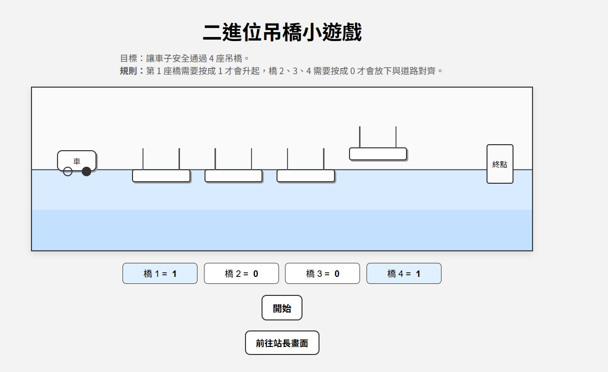

## 吊橋遊戲：透過遊戲化情境理解二進制

本專案以「吊橋過橋」為情境，透過是否存在（0 / 1），
協助學生理解二進制中的概念。



```
在吊橋畫面同學可以反思 0 1 代表的意思是吊橋的高低嗎，還是吊橋有沒有充電呢(高低電位)？
```


```
站長畫面因為不能看到實體橋的狀態，模擬電腦只會判斷高低電位
```
## 適用對象
- 國中資訊課
- 高一資訊概論
- 初學程式設計者

## 學習目標
- 理解二進制概念

